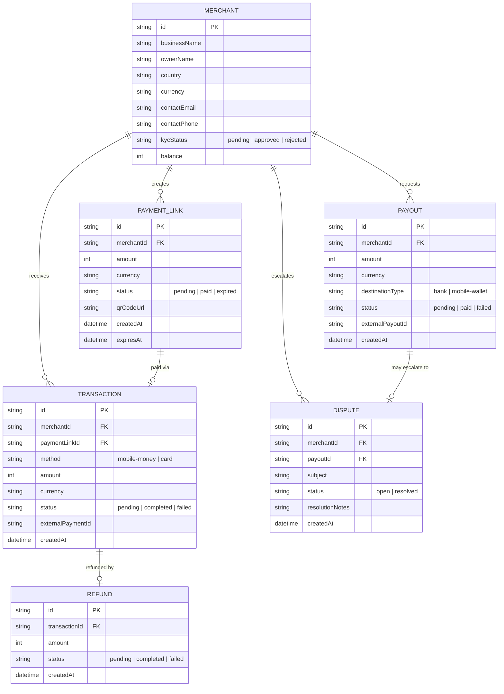

# Domain Model

The core entities behind merchant onboarding, payment collection and payouts.

- **Merchant** carries its running `balance` and `kycStatus`, set by Platform
Admin review.
- **PaymentLink** is what a Merchant generates for a sale; a Customer opens it
to pay — its `status` tracks whether it has been paid or has expired.
- **Transaction** records one completed or attempted payment against a
PaymentLink, via mobile money or card, through the payment gateway.
- **Refund** reverses a completed Transaction, in full.
- **Payout** is a Merchant's withdrawal request against its balance, to a bank
account or mobile wallet.
- **Dispute** is an escalated, unresolved payout failure or complaint a
Platform Admin resolves.

