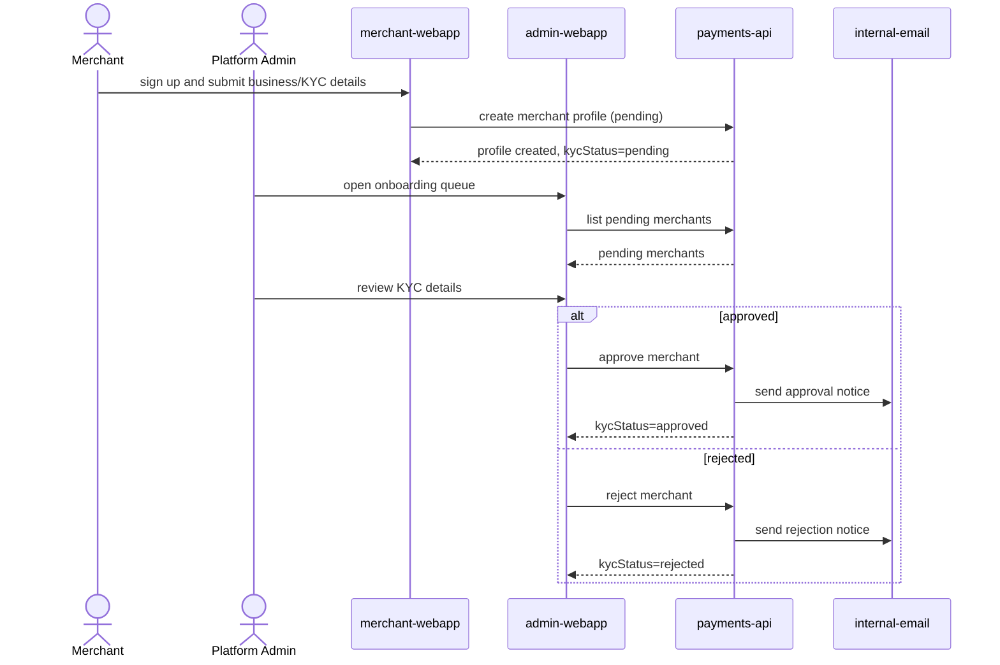

# Merchant Onboarding

A Merchant registers and submits KYC details, and a Platform Admin reviews the
application before the merchant can collect payments.

```mermaid
sequenceDiagram
    actor Merchant
    actor Admin as Platform Admin
    participant webapp as merchant-webapp
    participant admin as admin-webapp
    participant api as payments-api
    participant email as internal-email

    Merchant->>webapp: sign up and submit business/KYC details
    webapp->>api: create merchant profile (pending)
    api-->>webapp: profile created, kycStatus=pending
    Admin->>admin: open onboarding queue
    admin->>api: list pending merchants
    api-->>admin: pending merchants
    Admin->>admin: review KYC details
    alt approved
        admin->>api: approve merchant
        api->>email: send approval notice
        api-->>admin: kycStatus=approved
    else rejected
        admin->>api: reject merchant
        api->>email: send rejection notice
        api-->>admin: kycStatus=rejected
    end
```

