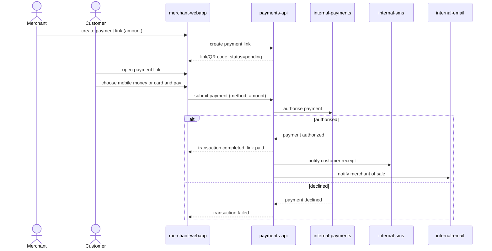

# Payment Collection

A Merchant generates a payment link, and a Customer pays it via mobile money
or card; both are notified once it clears.

```mermaid
sequenceDiagram
    actor Merchant
    actor Customer
    participant webapp as merchant-webapp
    participant api as payments-api
    participant gateway as internal-payments
    participant sms as internal-sms
    participant email as internal-email

    Merchant->>webapp: create payment link (amount)
    webapp->>api: create payment link
    api-->>webapp: link/QR code, status=pending
    Customer->>webapp: open payment link
    Customer->>webapp: choose mobile money or card and pay
    webapp->>api: submit payment (method, amount)
    api->>gateway: authorise payment
    alt authorised
        gateway-->>api: payment authorized
        api-->>webapp: transaction completed, link paid
        api->>sms: notify customer receipt
        api->>email: notify merchant of sale
    else declined
        gateway-->>api: payment declined
        api-->>webapp: transaction failed
    end
```

