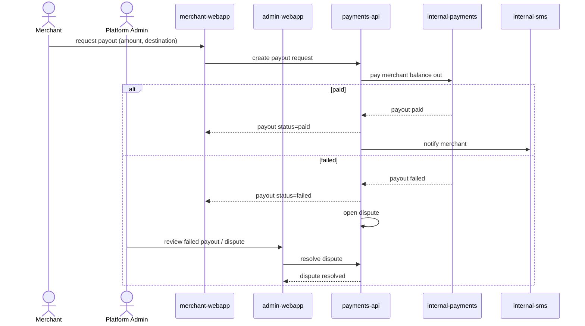

# Payout Request

A Merchant withdraws its balance to a bank account or mobile wallet; a failed
payout escalates to a Platform Admin.

```mermaid
sequenceDiagram
    actor Merchant
    actor Admin as Platform Admin
    participant webapp as merchant-webapp
    participant admin as admin-webapp
    participant api as payments-api
    participant gateway as internal-payments
    participant sms as internal-sms

    Merchant->>webapp: request payout (amount, destination)
    webapp->>api: create payout request
    api->>gateway: pay merchant balance out
    alt paid
        gateway-->>api: payout paid
        api-->>webapp: payout status=paid
        api->>sms: notify merchant
    else failed
        gateway-->>api: payout failed
        api-->>webapp: payout status=failed
        api->>api: open dispute
        Admin->>admin: review failed payout / dispute
        admin->>api: resolve dispute
        api-->>admin: dispute resolved
    end
```

